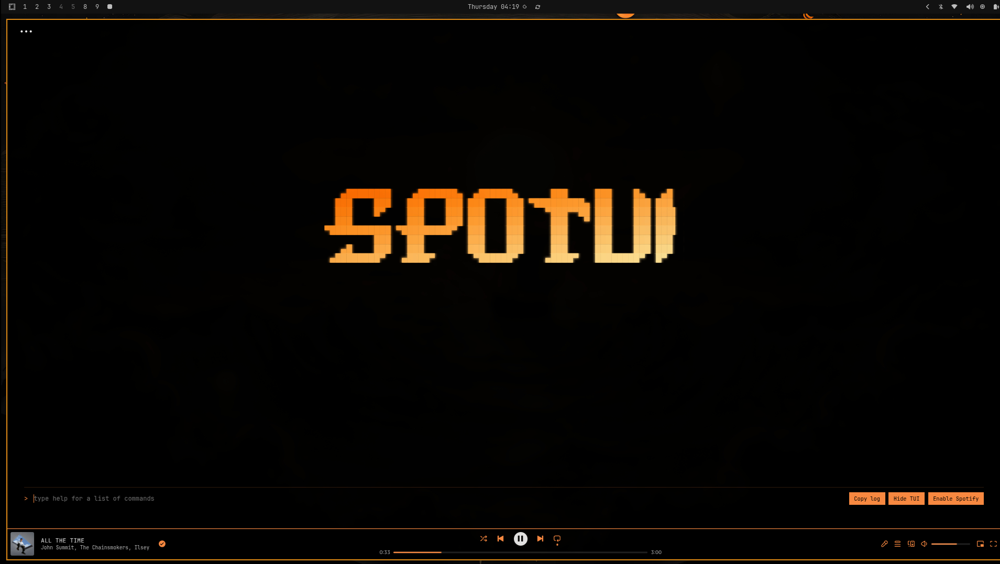

# SpoTUI

SpoTUI is a terminal-style Spotify skin built for Spicetify.

It combines:
- a custom UI overlay in `theme.js`
- theme styling in `user.css`
- Spotify color values in `color.ini`

## Screenshot


## Features

- Terminal-inspired interface
- Built-in playback controls
- Playlist browsing and management
- Spotify-native fallback mode
- Copy-log and hide/show controls

## Installation

<details>
<summary>Linux</summary>

1. Open a terminal.
2. Go to your Spicetify themes directory:
   ```bash
   cd ~/.config/spicetify/Themes
   ```
3. Clone or pull this repo into that folder:
   ```bash
   git clone https://github.com/SkenSMasteR/SpoTUI SpoTUI
   ```
   If you already have it locally, update it instead:
   ```bash
   cd SpoTUI
   git pull
   ```
4. Set SpoTUI as your current theme:
   ```bash
   spicetify config current_theme SpoTUI
   ```
5. Apply Spicetify:
   ```bash
   spicetify apply
   ```

</details>

<details>
<summary>Windows</summary>

1. Open PowerShell or Command Prompt.
2. Go to your Spicetify themes directory:
   ```powershell
   cd $env:APPDATA\spicetify\Themes
   ```
3. Clone or pull this repo into that folder:
   ```powershell
   git clone https://github.com/SkenSMasteR/SpoTUI SpoTUI
   ```
   If you already have it locally, update it instead:
   ```powershell
   cd SpoTUI
   git pull
   ```
4. Set SpoTUI as your current theme:
   ```powershell
   spicetify config current_theme SpoTUI
   ```
5. Apply Spicetify:
   ```powershell
   spicetify apply
   ```

</details>


## Usage

After applying the theme, open Spotify and use the SpoTUI interface directly from the client.

The built-in command list includes:

- `tui -m [command|cli]`
- `playlist`
- `list`
- `queue`
- `play`
- `pause`
- `p`
- `skip`
- `back`
- `v <percent>`
- `volume <percent>`
- `shuffle`
- `loop [on|off]`
- `superloop [on|off]`
- `search`
- `clear`

## Theme Files

- `theme.js` - JavaScript UI logic
- `user.css` - Spotify UI styling overrides
- `color.ini` - theme colors
- `preview.png` - Marketplace preview image

## Author

SkenS - https://github.com/SkenSMasteR
