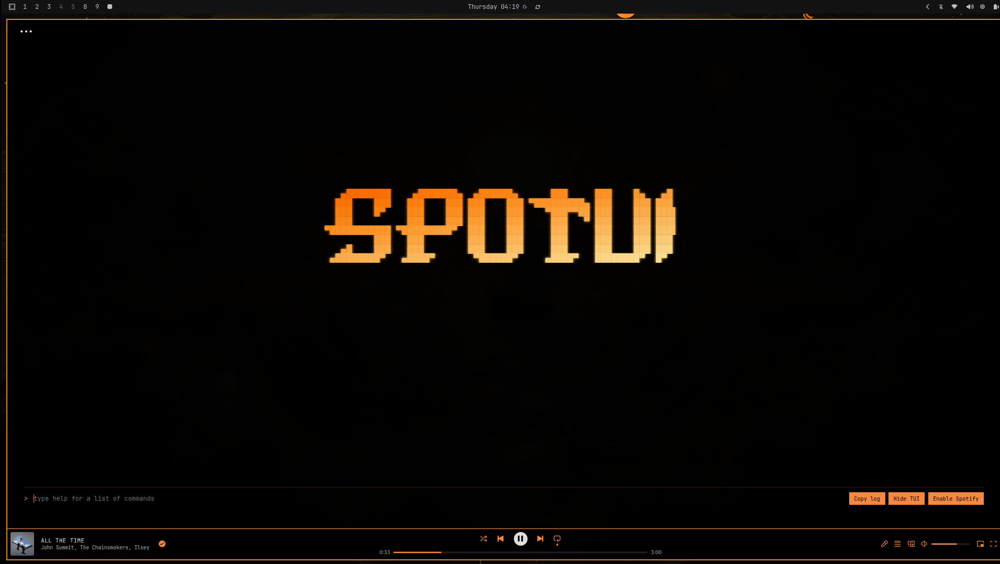
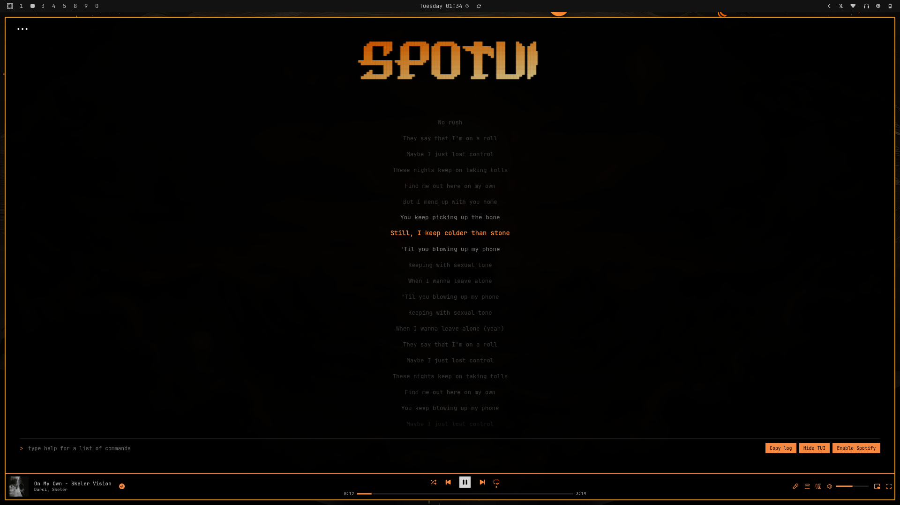

# SpoTUI

[](https://skensmaster.github.io/SpoTUI-Docs/)

SpoTUI is a terminal-inspired theme for Spotify that overlays a custom, keyboard-driven interface directly inside the Spotify client. It is built for [Spicetify](https://spicetify.app/).

## How It Works

SpoTUI is a self-contained Spicetify theme that uses:
- **`theme.js`**: A vanilla JavaScript component that creates and manages the entire TUI, including panels, commands, and Spotify API interactions.
- **`user.css`**: CSS overrides to hide the default Spotify UI and style the SpoTUI interface.
- **`color.ini`**: Standard Spicetify color definitions.

## Features

- **Terminal Interface**: A command-driven overlay with a familiar feel.
- **Multiple Panels**:
    - **Lyrics**: Synced, auto-scrolling lyrics view.
    - **Playlists**: A two-pane view to browse playlists and their tracks.
    - **Help**: A quick reference for all available commands.
- **Keyboard Navigation**: Control everything without touching the mouse.
- **Built-in Commands**: Manage playback, volume, playlists, and more.
- **Spotify Native Fallback**: Seamlessly switch back to the standard Spotify UI when needed.

## Screenshots




### Lyrics View


## Installation

<details>
<summary>Linux</summary>

1.  Open a terminal.
2.  Run the installer:
    ```bash
    curl -fsSL -o install.sh https://raw.githubusercontent.com/SkenSMasteR/SpoTUI/refs/heads/master/scripts/install/linux/install.sh && chmod +x install.sh && ./install.sh
    ```
3.  Select "Install" from the menu.

</details>

<details>
<summary>Windows</summary>

1.  Open PowerShell.
2.  Run the installer:
    ```powershell
    iwr -useb https://raw.githubusercontent.com/SkenSMasteR/SpoTUI/refs/heads/master/scripts/install/windows/install.ps1 | iex
    ```
3.  Select "Install" from the menu.
</details>

<details>
<summary>Marketplace</summary>

1.  In Spotify, go to the Spicetify Marketplace.
2.  Select "Themes" and search for `SpoTUI`.
3.  Install the theme.

</details>

## Usage

Type `help` in the SpoTUI command bar to see a list of available commands.

| Command                | Description                    |
| -----------------------| -------------------------------|
| `tui -l -a <on/off>`   | Toggle ASCII animation         |
| `tui -wp <url> [-o <opacity>]` | Set wallpaper (opacity 0-1) |
| `tui -wp off`          | Remove wallpaper               |
| `playlist` / `list`    | Open playlist viewer           |
| `play` / `pause` / `p` | Toggle playback                |
| `skip`                 | Next track                     |
| `s` / `seek <mm:ss>`      | Jump to a specific time        |
| `v` / `volume <%>`     | Set volume (0-100)             |
| `shuffle`              | Toggle shuffle                 |
| `loop` / `superloop`   | Toggle repeat mode             |
| `lyrics`               | Toggle lyrics panel            |
| `search`               | Open Spotify's native search   |
| `clear`                | Clear the TUI output           |
| `theme`                | Browse and apply themes        |
| `help`                 | Show the help panel            |

## Contributing

You can add your own theme to the theme browser by visiting [spotui.root.sx](https://spotui.root.sx/).

**Note**: You can only submit one theme every 24 hours.


## Notable forks of my project
<details>
<summary>SouRyan</summary>
SouRyan - https://github.com/SouRyan/SpoTUI-By-SouRyan
</details>


## Author

SkenS - https://github.com/SkenSMasteR
